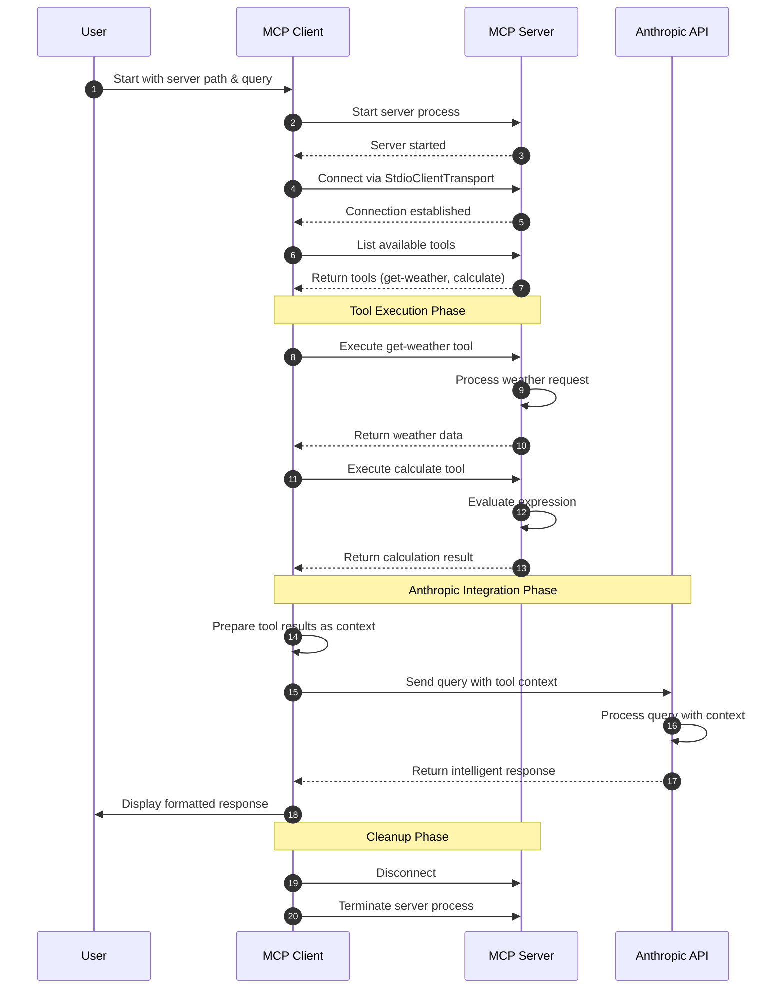
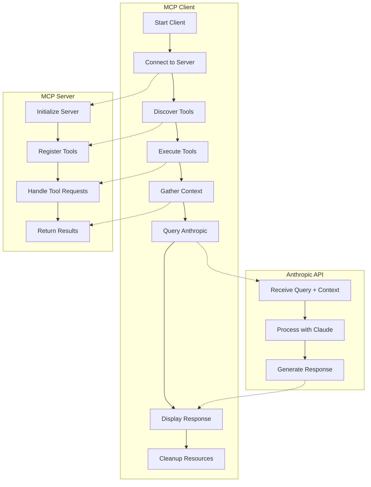

# MCP Client with Anthropic Integration - Architecture Diagrams

This document provides visual representations of the interaction between the MCP client, server, and Anthropic's Claude API in the project codebase.

## Sequence Diagram

The following sequence diagram shows the step-by-step interaction flow between all components:

## Component Flow Diagram

This diagram illustrates the high-level workflow and responsibilities of each component:

## Key Components

### MCP Client
The client manages the overall workflow by:
1. Starting and connecting to the MCP server
2. Discovering available tools
3. Executing tools to gather context
4. Sending the context and user query to Anthropic
5. Displaying the response and cleaning up resources

### MCP Server
The server is responsible for:
1. Registering tools (get-weather, calculate)
2. Processing tool execution requests
3. Returning results to the client

### Anthropic API
The Anthropic service:
1. Receives the user query along with tool-generated context
2. Processes the information using the Claude model
3. Returns an intelligent response that incorporates the tool results

## Data Flow

1. **Tool Discovery**: Client retrieves available tools from the server
2. **Tool Execution**: Client sends tool requests to the server and receives results
3. **Context Building**: Tool results are formatted as context for the AI
4. **AI Integration**: Context and user query are sent to Anthropic for processing
5. **Response Handling**: AI response is received and displayed to the user

## Implementation Details

- The client uses the `@modelcontextprotocol/sdk` package to connect to the server
- Communication is handled via `StdioClientTransport`
- The server registers tools with descriptions and input schemas
- Tool results are formatted as structured context in the system prompt for Anthropic
- The Anthropic API is accessed using the `@anthropic-ai/sdk` package
